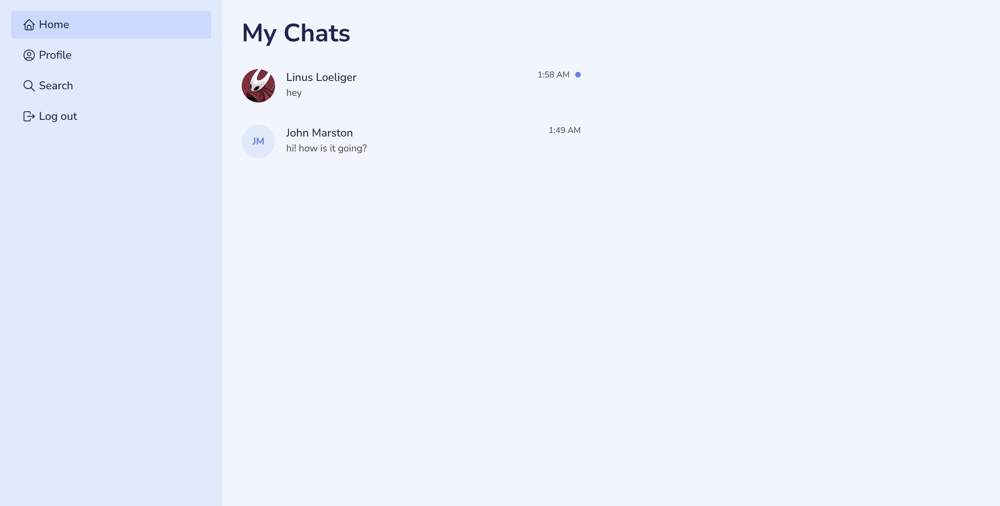

# Linku

Linku is a real-time chat application.

## Features

- User authentication
- Profile personalization
- Search users
- Real-time messaging with others

## Tech Stack

- Programming Language: TypeScript
- Frontend: React
- Backend: Node.js, Express
- Database: PostgreSQL and Redis

---

_This is a project for [The Odin Project](https://www.theodinproject.com/) curriculum._
